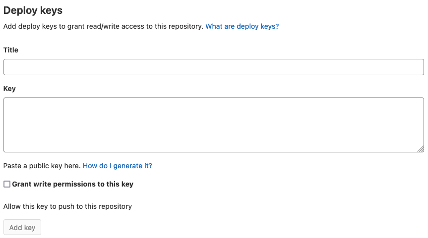

# How to deploy a static site using GitLab and Netlify CLI

This tutorial shows you how to connect a GitLab repository to a Netlify site using Netlify's command-line interface (CLI). Netlify CLI lets you configure continuous deployment from the command line. You can connect your repository to an existing site, or create and configure a new site.

This tutorial is intended for anyone with basic knowledge of Git, npm, continuous deployment, and the command line.

## Why you should deploy your site from the command line

Sometimes you can complete tasks much faster from the command line than by using a web UI. The command line also provides you more precision and control over the tasks you complete.

## Prerequisites

* A Netlify account
* A Git repository hosted on GitLab
* The latest versions of Node.js and npm

## Step 1: Install Netlify CLI

First, you need to install Netlify CLI. Run this command in your terminal: `npm install netlify-cli -g`.

**Important**: If you get a "permission denied" error, it's because npm doesn't have write access to the `usr/local/lib/node_modules` directory. See this [blog post](https://flaviocopes.com/npm-fix-missing-write-access-error/) from Flavio Copes that explains how to resolve the error.

To verify installation, run `netlify -v`.

## Step 2: Obtain a token through the command line

To authenticate and get an access token through the command line, run the command `netlify login`. 

You'll be asked to log in with Netlify to grant access to Netlify CLI.

## Step 3: Configure continuous deployment for your site

To connect your GitLab repository, run the command `netlify init --manual` from your local repository. This command configures continuous deployment for your site.

Next, the CLI asks you if you want to connect the repository to an existing Netlify site or create and configure a new site. Make sure to select "Create & configure a new site."

After that, the CLI walks you through several steps:

1. Selecting your team and site name
2. Entering a build command for your site
3. Setting the directory to deploy
4. Creating a Netlify functions directory
5. Creating a `netlify.toml` file, which is Netlify's configuration file

When prompted to continue in the terminal, press **enter**. You'll see a success message indicating that your site has been created.

After you complete these steps, the CLI provides you with two items you need to add to your repository settings in GitLab: a **deploy key** and a **webhook**.

### Step 3.1: Add a deploy key to your project

A **deploy key** is an SSH key that grants read-only or read-write access to your repository. The deploy key looks like this:

```bash
ssh-rsa AAAAAdkdh67x/lskdjfjTTIKGN585:lskdhfsnxnnrnOXNSNWMloiahwl8WE7R7E+4k...
```

Copy the key, and then open your project in GitLab. In the sidebar, go to **Settings > Repository**. Expand the **Deploy keys** section:



Give the key a title, like "Netlify" or the name of your site. Then paste the deploy key in the **Key** box. Click **Add key** to finish this task.

### Step 3.2: Add a GitLab webhook

Next, the CLI prompts you to configure a webhook. A webhook listens for specific events like pushes, issues, or merge requests. GitLab sends a ``POST`` request with data to the webhook URL.

The URL looks like this:

```bash
https://api.netlify.com/hooks/XXXXXXXXXXXXXXXXX
```

Copy the webhook URL, and open **Settings > Webhooks** in GitLab. This is what the section looks like:


In the **URL** box, paste the webhook URL. If you want, you can specify a [secret token](https://docs.gitlab.com/ee/user/project/integrations/webhooks.html#secret-token).

In the **Trigger** section, you can select the events that are triggered when a certain action occurs, like pushing to a specific branch, creating a new issue, or updating a merge request. Then, click **Add webhook** at the bottom of the page.

## Step 4: Test deployment

After you add the deploy key and webhook, you'll see a message indicating that Netlify CI/CD has been configured for your site. The last thing to do is push to your repository to trigger a new site build.

Complete the following steps:

1. Make a small change to a file on a branch in your local repository.
2. Commit the change and merge the change into your upstream repository.
3. Next, go to your Netlify account. You'll see your first deploy in progress in the **Builds** section.
4. Click on the deploy to monitor the build progress.
5. Once your site deploys successfully, click **Open production deploy** to view your live site.

## Troubleshooting

If your deployment fails, here are a few things to try:

1. Make sure the build command and publish directory are correct.
2. Make sure the site builds locally.

See Netlify's [Build troubleshooting tips](https://docs.netlify.com/configure-builds/troubleshooting-tips) in the Netlify Docs for more help.
